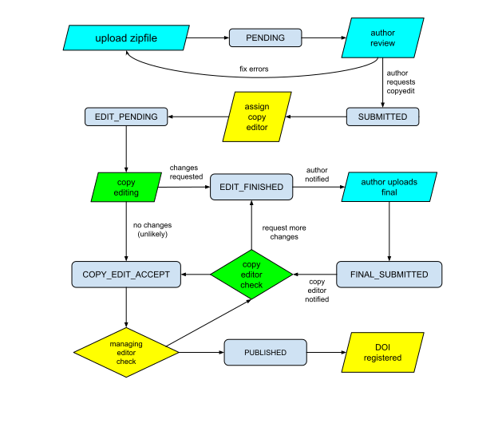
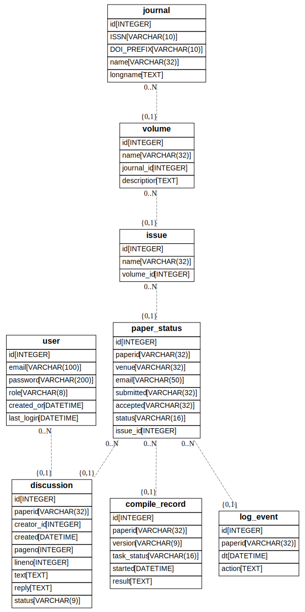

# IACR LaTeX Publishing Workflow

This repository contains a web server to support the workflow of
submission of final papers for a journal (the IACR Communications
in Cryptology).

## Publishing workflows

The purpose of this server is to fulfill part of the publishing
workflow for a journal. Once a paper is accepted by a review process,
the authors will be pointed to this server in order to upload their
final versions.  This is but one part of a publishing workflow based
on a LaTeX class that captures metadata about publications.

A publishing workflow consists of several steps, which may
include:

1. writing by the author(s)
2. submission for review
3. a review process
4. feedback to authors
5. possible revision
6. submission of final version
7. copy editing, with feedback to authors
8. revision by author or copy editor to fix errors.
9. production of final version
10. registration of metadata
11. hosting for publication.

This project is only designed to fulfill steps 6-11 in a process that
is automated to the extent possible. The one step that is impossible
to automate is copy editing, which is mentioned in a separate section
at the end.  One crucial feature of step 8 is that the `iacrcc` LaTeX
class produces machine-readable metadata as a byproduct of compiling
the LaTeX.

The design of this application is heavily dependent on the use of the
IACR `iacrcc.cls` LaTeX class, because when papers written in that
class are processed, the metadata from the paper is automatically extracted.
This project has a submodule from IACR/latex in order to import
`iacrcc.cls`. In order to pull this in, use
```
git submodule update --init --recursive --remote
```
This also pulls in `cryptobib` since IACR/latex depends on it.

## Architecture

The author is expected to upload a zip file to this server with their
LaTeX sources. Compilation of LaTeX received from third parties
constitutes a security risk. For this reason, the production of PDF or
HTML from LaTeX should either be done by authors or within a
controlled environment. Due to the fact that LaTeX is a programming
environment, we have chosen to provide a controlled environment so as
to enforce a look and feel of the papers by limiting which LaTeX
packages may be used. This is essentially the same approach taken by
ACM and arXiv.

NOTE: The original implementation used celery to maintain a queue of
compilation tasks and execute them. This was deemed to be too
complicated because it required running three servers, namely the web
server, redis, and a celery worker. This has some advantages for
scalability and running as a distributed system, but since we only
process one run of LaTeX at a time, we deemed it unnecessary. If this
is adapted to a higher-throughput environment, then celery is probably a
good choice.

The actual compilation is carried out in a docker container that is
started for each paper upload. Using a docker container provides some
degree of security against malicious uploaded LaTeX code.  The web
server keeps a queue of tasks and executes them one by one with a
`ThreadPoolExecutor`.  When an author uploads their paper, they are
shown their position in the queue. The user's browser waits until the
task is finished, and displays the results to the user. If the user tries to
upload another version of their paper before the first one is finished, it
is rejected until compilation of the first upload is completed.

### Details about the flow

When the author uploads their zipfile, they also include several
items:
* a unique paper ID that encodes the ID of the paper in the reviewing system.
* an email address of the submitting author.
* the original submission date prior to review
* the acceptance date.

When the submission server forwards the author to at GET at /submit,
the fields will be included as URL parameters, and include an HMAC To
authenticate the payload. For paper ID of `xyz`, the server will store
data for this upload in the directory `webapp/data/xyz`.  For this
reason, the `paperid` must be "directory-safe" using only characters
[-.a-z0-9]. The `paperid` is assumed to be globally unique and is
assigned by the workflow prior to it being received by this server
(e.g., by hotcrp). For IACR this would generally be something like
`tosc_2023_1_15` if it had been assigned paper #15 in a hotcrp version
called `tosc_2023_1`, but the volume and issue number will not be
derived from this.

We don't store every version that is uploaded, but we store
potentially three versions:
1. the "candidate" version from the author. This can be replaced by the author
   up until the time that they mark it as ready for copy editing.
2. the "copyedit" version of the paper. This is created once the author decides
   that they are satisfied with the "candidate" version. It is
   essentially the same as the "candidate" version except it contains
   line numbers.
3. the "final" version of the paper. This is uploaded by the author in
   response to copy edit instructions. It may be replaced by the author up
   until the time that it is finalized by the copy editor.

These directory structure for these versions is:
```
webapp/data/<paperid>/status.json
webapp/data/<paperid>/candidate/all.zip
webapp/data/<paperid>/candidate/input
webapp/data/<paperid>/candidate/output
webapp/data/<paperid>/candidate/compilation.json
webapp/data/<paperid>/copyedit/input
webapp/data/<paperid>/copyedit/output
webapp/data/<paperid>/copyedit/compilation.json
webapp/data/<paperid>/final/all.zip
webapp/data/<paperid>/final/input
webapp/data/<paperid>/final/output
webapp/data/<paperid>/final/compilation.json
```

The `compilation.json` files are serializations of the `Compilation`
object in `webapp/metadata/compilation.py`.  The server keeps a
database to track the flow of papers through the workflow. This
database is currently based on sqlite and is accessed via
SQLAlchemy. In the event that this database needs to grow in the
future, SQLAlchemy makes it easy to migrate to mariadb or postgres.

The workflow transitions between `candidate`, `copyedit`, and `final` are
shown in the figure below.

.

The `candidate` version is created at the very beginning when the
author uploads their zip file. As soon as the `candidate` version is
flagged as acceptable to the author, then it may no longer be
edited. The `copyedit` version is created when the copy editor is
assigned. This is derived from the `candidate` version by only adding
page numbers. The copy editor reviews the paper and creates a list of
queries to the author for them to correct.  The `final` version is
created when the author uploads their response to the copy editor. As
it stands now, the copy editor can only send messages to the author to
change their file - the copy editor does not directly edit the LaTeX.
If the copy editor submits further queries to the author, then they can
continue to upload a `final` version until the copy editor is satisfied.
Once they are satisfied, the `final` version is frozen and used to
produce the published paper.

### Database schema

The database is used to store relational data about journals, volumes,
issues, papers, versions, discussion, users, and log events. The
schema is subject to change, but is currently shown below. This was
generated with
```
eralchemy -i 'sqlite:///db.sqlite' -o db_erd.dot
```
followed by post-processing on the dot file.

.

### Authentication in URLs

As mentioned previously, when the author is referred to /submit, there
will be URL paramters that are authenticated with an hmac using a key
shared between the review system and this server. Thereafer the user
is supplied with URLs of the form
```
/view/<paperid>/<version>/<auth>
/view/<paperid>/<version>/<auth>/main.pdf
```
where `auth` is another hmac created by the server to obfuscate the URLs.
An author is free to share these URLs with other authors so that we do
not require authors to login on the site. This may change in the future,
because there is now authentication on the site to restrict access to
the `/admin` section of the site.

### The compilation process

When either the `candidate` or `final` version is created, the server
stores the zip file in the appropriate directory, and unzips it into
the `input` subdirectory. The server runs LaTeX on it, producing the
content in the `output` subdirectory.

A compilation is done by submitting a task to the
ThreadPoolExecutor. When the thread runs, it creates a docker
container with a limited version of texlive along with the
`iacrcc.cls` file.  It runs `latexmk` to compile the paper using
`lualatex` plus either `bibtex` or `biber`, producing either an error
log or a successful output.  If the LaTeX compilation is successful,
then there is further processing on the `main.meta` output file from
`iacrcc.cls`. There are various things that can go wrong: 1. the zip
file could be incomplete, or the `main.tex` file might be missing.
2. the paper may fail to compile with `lualatex`. This can happen for
various reasons, including: a. a missing style file in our texlive
distribution.  b. missing metadata in the LaTeX file.  c. a missing
font in our texlive distribution.  d. a flaw in the supplied metadata
(e.g., no author with an email, or an empty author name).

LaTeX environements can vary quite a bit, and this can complicate the
submitting author's ability to submit suitably well formed LaTeX.  The
controlled environment we use is based on texlive, but we allow access
to only a limited number of packages. Because of this, it is important
to provide detailed error messages to the submitting authors so that
they may understand how to fix their problems.

## Installation

Installation is as follows (TODO: review this):

```
python3 -m pip install flask
python3 -m pip install flask-mail
python3 -m pip install flask-login
python3 -m pip install Flask-SQLAlchemy
python3 -m pip install flask-WTF
python3 -m pip install docker
python3 -m pip install arxiv-latex-cleaner
sudo apt install docker
```
add user to docker group with
```
sudo usermod -aG docker $USER
```
Then you will need to logout and login again.

```
cd webapp/compiler
docker build -t debian-slim-texlive2022 .
```
(note the dot at the end). While you are in that directory, you should try
running `webapp/compiler/runner.py` on some sample input to check that
the docker compiler is working.

## Running the app in dev

In order to start the web server, run:
```
python3 run.py
```

At this point you should be able to point your browser at localhost:5000

## Running the app in production

The web server would ordinarily be started behind apache running
mod_wsgi. This requires a `.wsgi` file, which isn't checked in
here. Your environment may vary to run it (e.g., with another wsgi
server behind nginx).

## Copy editing

The step for copy editing is purely a human process, which makes it
the most costly part of the process of publishing. There is room for
argument on how much effort should be put into copy editing. Obviously
many manuscripts would benefit greatly from careful copy editing,
particularly for manuscripts written by an author whose native
language is not English. Unfortunately, because of the human cost of
editing, we restrict the activity to a very narrow set of corrections.
Specifically, we have adopted a stripped-down process derived from the
[AMS editorial-light
guidelines](https://docplayer.net/122465-Mathematics-into-type.html)
in the book "Mathematics into Type" by Ellen Swanson. The primary goal of
this is to "do no harm" to the science embodied in the paper. Even small things
like spell correction run the risk of introducing factual errors.

The end result of an extremely light copy-editing process is that some
manuscripts will end up being poorly written. We have taken the
decision that this should reflect back on the authors themselves. ACM
has taken a similar stance, but [partners with the International
Science Editing service
(ISE)](https://www.acm.org/publications/authors/submissions) to
provide language editing services for authors. The cost of these
editing services is borne by the authors.