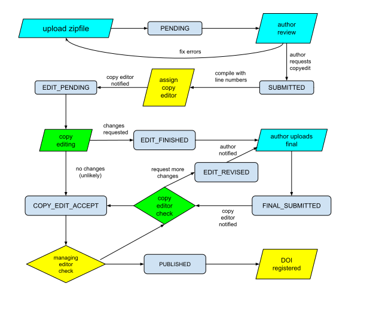

# IACR LaTeX Publishing Workflow

## Contents
* [Publishing workflows](#publishing-workflows)
* Alternative approaches
* Architecture
* Installation
* Running in development mode
* Running in production
* Copy editing
* Publishing an issue

## What is this?

This repository contains two web servers to support the workflow of
submission of final papers for the journal ([IACR Communications in
Cryptology](https://cic.iacr.org/). The system may prove useful for
other journals in computer science and mathematics, but that depends
upon them using a similarly crafted [LaTeX class
file](https://publish.iacr.org/iacrcc).  We might need to make some
modification to the UI to remove IACR branding, but that part would be
straightforward. If you think that you might want to do this, we
should discuss how to accomplish it.

The two servers have separate code located in the
[`search`](search/README.md) directory and
[`webapp`](webapp/README.md) directory.  The reason why there are two
web servers is that the `xapian` package is distributed under the GPL
license, so we isolate the search part of this application into its
own server in order to allow other licenses for the main web
server. We use apache `mod_wsgi` to configure the search server to run
under the path `/searchapi` and return JSON. The rest of the app runs
at the root of the server, and only communicates to the search part
via the network.

All of the discussion below refers to the main publishing server, and
you should look in the [`search`](search/README.md) directory for
documentation on the search part (which is relatively simple).

## Publishing workflows (#publishing-workflows)

Our goal in designing this system is to reduce the amount of human
labor as much as possible in order to minimize the cost of publishing
a journal.  We estimate that our marginal cost to publish the journal
is approximately $900 per year to publish 200 papers. In order to
publish 1000 papers per year it would cost $1700. This cost includes
the cost of cloud services for running the servers, the cost of
membership in crossref, the cost of a digital preservation service,
and the cost of registering individual DOIs. It excludes human labor
for maintaining the servers or performing copy editing, because we do
that with volunteers (as do most scholar-run journals). It is important
to provide a good user interface for these volunteers, so that they
do not regret the donation of their time.

The publishing workflow for a journal consists of a number of steps, but
they can basically be partitioned into three parts shown in the figure
below.


In the implementation of the workflow for the journal, we can think of
these as replacable components, with relatively simply APIs between
them.  For example, authors submit their papes to the submission and
reviewing component, and when their paper is accepted, they are simply
provided with a URL to upload their final version to this server. The
URL is is authenticated via an HMAC, and no accounts need to be
maintained on this server. Similarly, when copy editing and production
is finished on an issue, it is exported as a zip file to the indexing
and web hosting part.

These three components are implemented as separate servers for
the Communications in Cryptology, and their implementation is described
below. These components run as [submit.iacr.org](https://submit.iacr.org/),
[publish.iacr.org](https://publish.iacr.org/), and [cic.iacr.org](https://cic.iacr.org/)

#### Submission and reviewing

We use an instance of a [fork](https://github.com/IACR/hotcrp)
of [`hotcrp`](https://github.com/kohler/hotcrp)
for each issue of the journal. For example, Volume 1, Issue 1 was done with
[`submit.iacr.org/cic2024_1`](https://submit.iacr.org/cic2024_1).
Papers for an issue are submitted to the hotcrp instance, and reviewed using
a workflow much like a conference. The output from this is a set of
authorizations (URLs) for authors to upload their final versions to
the next phase. Some papers may be held over for a second round of review
and actually appear in a later issue of the journal. In theory
it should be possible to replace the reviewing system by something
else like [`openreview.net`](https://openreview.net) or the reviewing
component of Janeway or OJS. We anticipate that peer review will evolve
in years to come, and we prefer to maintain that as a separate piece
of the publishing workflow.

#### Copy editing and production

This is the server that runs on [publish.iacr.org](https://publish.iacr.org/)
and the code for this is located under the [`webapp`](webapp/README.md)
directory. The [`search`](search/README.md) functionality is used to provide
useful tools for authors to find ROR IDs and bibliographic references.

#### Indexing and web hosting

The output from the copy editing and production phase is a zip file
that contains the articles to be published in an issue. This zip file
is imported into [cic.iacr.org](https://cic.iacr.org), where articles
are registered for their DOIs from crossref, and immediately
hosted. This server also provides the bundle that is provided to a
digital preservation service. The code for this server resides in
a separate repository that will eventually be made open source.

## Alternative approaches

A system that implements all of the steps in a publishing workflow is
necessarily quite complex, because there are multiple paths between
authors, editors, reviewers, copy editors, and production
editors. Before developing this server, we considered
alternatives, the most obvious of which are
[OJS](https://pkp.sfu.ca/software/ojs/) and
[Janeway](https://github.com/BirkbeckCTP/janeway). In this section
we describe why we rejected these.

#### Reviewing

First, these servers are written as monolithic, totally integrated
systems, which means they provide all three of the phases in the
publishing workflow. Their review process is a traditional journal
model in which papers may be submitted at any time, and an editor
assigns a referee to each paper.  We prefer a process where papers for
an issue are submitted by a deadline, and decisions to accept, reject,
or submit to a later issue are completed by a deadline.  Moreover, our
review process is more transparent process because reviews are done by
members of a known committee. The members of the committee are public,
though their assignments as reviewers are not. As such, the review
process we use is semi-double-blind because reviewers do not see
author names, but authors know that their referees are chosen from a
public set. This review process has the advantage that reviewers are
publicly acknowledged, which provides better incentive for reviewers
to agree to the task.

#### Support for LaTeX

Mathematicians and computer scientists currently write academic papers
in LaTeX, and neither OJS nor Janeway provide any significant support
for LaTeX production and editing.  LaTeX is both a blessing and a
curse. It's a blessing because it provides authors an environment in
which they can produce professionally typeset material themselves,
which greatly streamlines the production phase.  Moreover, the
structural aspect of LaTeX allows us to have authors produce documents
according to a [predefined style](https://github.com/IACR/latex/) that
helps to
[optimize](http://ftp.tug.org/TUGboat/tb44-1/tb136bos-metadata.pdf)
the handling of metadata during the production process.  Our system
depends heavily on this metadata handling feature, though it would be
relatively easy to separate out the metadata handling parts from our
LaTeX class so that another journal could use it.

Unfortunately, LaTeX is also a curse in that it is a full programming
language, giving authors too much freedom to violate a style chosen
for the journal. It also turns out that it's
[unsafe](https://www.usenix.org/system/files/login/articles/73506-checkoway.pdf)
to compile LaTeX received from strangers. Finally, the complexity of
the LaTeX typesetting language could be difficult for copy editors to
understand.  We solve this problem by pushing back on authors to make
fixes to their documents, and the copy editor merely has to validate
that the changes produce a valid result.

Another potential problem with LaTeX is that it's designed to produce
a PDF rather than a more display-friendly format like HTML. If this is
important for your journal, then you probably should look at other
approaches besides LaTeX. The production of HTML from LaTeX is currently
a work in progress, but arxiv is pursuing this.

#### Support and maintenance

Both OJS and Janeway appear to have been professionally developed and
maintained, but we found it hard to fit our requirements using
them. Unfortunately, it would be very difficult to maintain the
extensive changes that we would require to those systems.

From a software standpoint, OJS is written in the fairly archaic
programming language of PHP with Smarty templates. Front-end web
development is increasingly moving toward javascript frontends with
REST backends, and fewer people are learning PHP as a result. We
consider this to be a drawback.

By contrast, Janeway is written in python Django. Django is very
popular but also [very
opinionated](https://dev.to/heroku/opinionated-or-not-choosing-the-right-framework-for-the-job-4e9f)
about how things should be done. In my experience this makes it harder
to customize.

## Architecture (#architecture)

The author is expected to upload a zip file to this server with their
LaTeX sources. Compilation of LaTeX received from third parties
constitutes a security risk. For this reason, the production of PDF or
HTML from LaTeX should be done within a controlled
environment. Moreover, our controlled environment enforces some
restrictions on the submitted LaTeX to make sure that it adheres to
the look and feel designed for the journal. This is essentially the
same approach taken by ACM and arXiv.

NOTE: The original implementation used celery to maintain a queue of
compilation tasks and execute them. This was deemed to be too
complicated because it required running three servers, namely the web
server, redis, and a celery worker. This has some advantages for
scalability and running as a distributed system, but since we only
process one run of LaTeX at a time, we deemed it unnecessary. If this
is adapted to a higher-throughput environment, then celery is probably a
good choice.

When an author uploads their zip file of LaTeX source, the server
spawns a thread that in turn starts a docker container that processes
the LaTeX. Using a docker container provides some degree of security
against malicious uploaded LaTeX code.  The web server keeps a queue
of tasks and executes them one by one with a `ThreadPoolExecutor`.
When an author uploads their paper, they are shown their position in
the queue. The user's browser waits until the task is finished, and
displays the results to the user. If the user tries to upload another
version of their paper before the first one is finished, it is
rejected until compilation of the first upload is completed.

### Details about the flow

When the author uploads their zipfile, the URL they use contains several
parameters:
* a unique paper ID that encodes the ID of the paper in the reviewing system.
* an email address of the submitting author.
* the original submission date prior to review.
* the acceptance date.
* the journal, volume, and issue that the paper is intended for

When the submission server forwards the author to at GET at /submit,
the fields will be included as URL parameters, and include an HMAC To
authenticate the payload. For paper ID of `xyz`, the server will store
data for this upload in the directory `webapp/data/xyz`.  For this
reason, the `paperid` must be "directory-safe" using only characters
[-.a-z0-9]. The `paperid` is assumed to be globally unique and is
assigned by the workflow prior to it being received by this server
(e.g., by hotcrp). For IACR this would generally be something like
`tosc_2023_1_15` if it had been assigned paper #15 in a hotcrp version
called `tosc_2023_1`, but the volume and issue number will not be
derived from this.

We don't store every version that is uploaded, but we store
potentially three versions:
1. the "candidate" version from the author. This can be replaced by the author
   up until the time that they mark it as ready for copy editing.
2. the "copyedit" version of the paper. This is created once the author decides
   that they are satisfied with the "candidate" version. It is
   essentially the same as the "candidate" version except it contains
   line numbers.
3. the "final" version of the paper. This is uploaded by the author in
   response to copy edit instructions. It may be replaced by the author up
   until the time that it is finalized by the copy editor.

The directory structure for the storage of these versions is:
```
webapp/data/<paperid>/status.json
webapp/data/<paperid>/candidate/all.zip
webapp/data/<paperid>/candidate/input
webapp/data/<paperid>/candidate/output
webapp/data/<paperid>/candidate/compilation.json
webapp/data/<paperid>/copyedit/input
webapp/data/<paperid>/copyedit/output
webapp/data/<paperid>/copyedit/compilation.json
webapp/data/<paperid>/final/all.zip
webapp/data/<paperid>/final/input
webapp/data/<paperid>/final/output
webapp/data/<paperid>/final/compilation.json
```

The `compilation.json` files are serializations of the `Compilation`
object in `webapp/metadata/compilation.py`.  These contain all metadata
associated with the paper, including title, subtitle, authors, affiliations,
funding, references, abstract, etc. The server also keeps a
database to track the flow of papers through the workflow. This
database is accessed via the SQLAlchemy layer, which makes it possible to
swap out the database implementation if it is needed to grow in the future.
We currently use mariadb, but we could as easily use sqlite3 or postgres.

The workflow transitions between `candidate`, `copyedit`, and `final` are
shown in the figure below.


.

The `candidate` version is created at the very beginning when the
author uploads their zip file. As soon as the `candidate` version is
flagged as acceptable to the author, then it may no longer be
edited. The `copyedit` version is created when the copy editor is
assigned. This is derived from the `candidate` version by only adding
page numbers. The copy editor reviews the paper and creates a list of
discussion items to the author for them to correct.  The `final`
version is created when the author uploads their response to the copy
editor.

A bit more about these states:
* PENDING - the author has uploaded a paper, but they are presented with
  warnings and errors. The author can repeatedly upload while in this state
  in order to correct warnings and errors. If a paper has only warnings,
  then they can present it for copyedit, which changes the state to
  SUBMITTED. At this point the author can no longer upload their candidate
  version because it is in the hands of the copy editor.
* SUBMITTED - in this state, a copy editor has not been assigned yet. The
  author may not upload another version.
* EDIT_PENDING - a copy editor has been assigned, and any copy editor may
  submit suggested changes. When the assigned copy editor is satisfied,
  they change the state to EDIT_FINISHED. This causes the author to be
  notified, and they have to respond to each requested or suggested change.
  Once they do this, the author can upload their final version. They may do
  this multiple times until they are satisfied that they responded to each
  requested or suggested change. At that point they set the state to
  FINAL_SUBMITTED - At that point they may not upload another final version,
  because it's in the hands of the copy editor.
* FINAL_SUBMITTED - the copy editor can look at the differences between the
  candidate version and the final version to verify that they responded to
  each discussion point. At this point the copy editor can accept the changes
  and move it to the COPY_EDIT_ACCEPTED state, or else the copy editor can
  request further changes, setting it to EDIT_REVISED. The copy editor gets
  a chance to add more requested changes, and once they are satisfied the
  author gets notified and can inspect the new requested changes and upload
  another final version.
* EDIT_REVISED - putting it in this state replaces the candidate version by the
  final version
  In the latter
  case the copy editor gets a chance to add more

The transitions take place as follows:

* PENDING -> EDIT_PENDING by a form submitted to `home_bp.compile_for_copyedit`. We
  currently bypass the state SUBMITTED and let copy editors claim ownership rather
  than assigning one.
* EDIT_PENDING -> EDIT_FINISHED by a form submitted from `admin_bp.copyedit` to
  `admin_bp.finish_copyedit`. The author is notified to view it at `home_bp.copyedit`.
* EDIT_FINISHED -> FINAL_SUBMITTED by a form from
  `home_bp.copyedit` -> `home_bp.show_submit_version` -> `home_bp.submit_version`.
* FINAL_SUBMITTED -> COPY_EDIT_ACCEPT is a form from `admin_bp.copyedit` submitted to
  `admin_bp.approve_final`.
* FINAL_SUBMITTED -> EDIT_REVISED is a form from `admin_bp.copyedit` submitted to
  `admin_bp.request_more_changes`. This replaces the candidate version by the final version
  and compiles it for copy editing.
* COPY_EDIT_ACCEPT -> EDIT_REVISED is a form from `admin_bp.final_review` submitted to
  `admin_bp.request_more_changes`.

After one round of copy editing, we hope that the `final` version
fulfills all of the required changes from the copy editor, but if they
find new problems or if the author hasn't corrected serious problems,
then the copy editing process starts anew.  In this case, the
`candidate` version is replaced by the `final` version and the
`copyedit` version is recompiled from the new `candidate` version. The
`final` version is removed and all existing discussion items are
archived because they no longer have line numbers and page numbers
that reference the `candidate` version.

It's possible that the new `final` version is actually worse than the
original `candidate` version, but the original `candidate` version is
lost at this point. If the copy editor wishes to avoid this, then they
should communicate to the author via email and have them upload a
different `final` version instead of cycling the `final` version to
replace the `candidate` version.

As it stands now, the copy editor can only send messages to the author
to change their LaTeX files - the copy editor does not directly edit
the LaTeX though they can view it and make suggestions.  If the copy
editor submits further items to the author, then they can continue to
upload a `final` version until the copy editor is satisfied.  Once
they are satisfied, the `final` version is frozen and used to produce
the published paper.

### Data model and database schema

A relational database is used to store relational data about journals, volumes,
issues, papers, versions, compilations, discussion, users, and log events.
There are various ways to understand the schema:
1. through the SQLAlchemy specification in the [`webapp/metadata/db_models.py`](webapp/metadata/db_models.py)
file. This is complicated by the fact that SQLAlchemy went through a major breaking
change in version 2.0, so many tools no longer work.
2. through the mysql schema for tables that are generated.
3. through a visual representation

From a high level point of view, there are journals, which contain
volumes, which contain issues, which contain papers. The main class
for a paper is the `PaperStatus`, which stores the most recent
information related to the paper. A paper may have different versions
(`candidate`, `copyedit`, or `final`), and for each version we store
information about the latest compilation of that version in the
`CompileRecord`. Thus for each paper there may be multiple
`CompileRecords` so we can compare what the author submitted
originally (the `candidate`) vs what the copy editor saw (the
`copyedit` version`) vs what the author uploaded after seeing their
copy editor feedback (the `final` version).

A visualization of the schema in sqlite can be created with
```
eralchemy -i 'sqlite:///db.sqlite' -o db_erd.dot
```
followed by post-processing on the dot file. Another view is provided
by mysql Workbench below (this version is slightly out of date
because the identity of the assigned copy editor is now stored in the `paper_status`
table.

.

This makes the hierarchy obvious:
```
Journal -> Volume -> Issue -> PaperStatus
```
A `PaperStatus` can have multiple `CompileRecord`, `LogEvent`, and `Discussion`
objects associated with them. The `result` field in `CompileRecord` is
the JSON serialization of the `Compilation` object.

### `db_models.py`
A journal, volume, or issue is defined by a record in [`db_models.py`](webapp/metadata/db_models.py).
When a hotcrp instance is created, it has journal, volume, and issue
identifiers that later show up in this server. Specifically the information
is matched as follows:
* journal (identified by hotcrp_key)
* volume (identified by name)
* issue (identified by name)

The information for a paper is stored permanently in the `PaperStatus`
record, and a paper is initially linked to an issue.  The paper may
later be moved to another issue, but this is done by changing the
`issue_id` in `PaperStatus`. A paper may be "unassigned" by setting
the `issue_id` to null. If a paper is assigned to an issue, then the
paper must be recompiled because the `main.iacrmetadata` file will
have to be changed to inject the volume and issue number back into the
PDF.

You can change the name or acronym of a journal or volume or issue,
but the `hotcrp_key` should remain fixed to identify which hotcrp
instance it came from.

### Usage for conferences
This system is designed for journals, but computer science often
uses a conference model of publication. That can be mapped into the data
model of this system in various ways, such as:
1. journal: ACM KDD
2. volume: year
3. issue: track (e.g., industry track vs research track vs invited talks).

This is a clumsy mapping, but at least it breaks things down in a
hierarchy.  For conferences that don't have multiple tracks, they
might have only a single issue. For conferences that occur multiple
times per year, they might have one volume per conference rather than
one volume per year. Alternatively, they could use year and use issue
to represent each individual conference. The mapping needs to be
selected in a way that best represents the hierarchy.

Alternatively, we could use this hierarchy:
1. journal: LNCS
2. volume: TCC
3. issue: year

The mapping is arbitrary, but keep in mind that a journal needs an
EISSN.  All LNCS volumes have the same EISSN of 1611-3349. Another
contraint is that administrative or copy editor access control must be
decided at the level of a journal or volume or issue (this is TBD).

### Authentication

#### Authors

When the author is referred to /submit, there
will be URL paramters that are authenticated with an hmac using a key
shared between the review system and this server. Thereafer the user
is supplied with URLs of the form
```
/view/<paperid>/<version>/<auth>
/view/<paperid>/<version>/<auth>/main.pdf
```
where `auth` is another hmac created by the server to obfuscate the URLs.
An author is free to share these URLs with other authors so that we do
not require authors to login on the site. 

Authors do not typically receive accounts on the system - they supply an email
address and receive notifications to that address. Views of their results
are authenticated in HMACS that are embedded into the URLs.

#### Admin and copy editor authentication

Administrators and copy editors receive accounts on the system and have
to login with a username/password. The access control is yet TBD, and for
the moment there is just one class of user.

### The compilation process

When either the `candidate` or `final` version is created, the server
stores the zip file in the appropriate directory, and unzips it into
the `input` subdirectory. The server runs LaTeX on it, producing the
content in the `output` subdirectory.

When a paper is compiled, the server creates a docker container with a
limited version of texlive along with the `iacrcc.cls` file.  It runs
`latexmk` to compile the paper using an author-selected LaTeX engine
(`pdflatex`, `lualatex`, or `xelatex`), plus either `bibtex` or
`biber`, producing either an error log or a successful output.  If the
LaTeX compilation is successful, then there is further processing on
the `main.meta` output file from `iacrcc.cls`.

There are various things that can go wrong:
1. the zip file could be incomplete, or the `main.tex` file might be missing.
2. the paper may fail to compile. This can happen for various reasons, including:
    - a missing style file in our texlive distribution.
    - missing metadata in the LaTeX file.
    -  a missing font in our texlive distribution.
    -  a flaw in the supplied metadata (e.g., no author with an email, or an empty
       author name).

LaTeX environements can vary quite a bit, and this can complicate the
submitting author's ability to submit suitably well formed LaTeX.  The
controlled environment we use is based on texlive, but we allow access
to only a limited number of packages. Because of this, it is important
to provide detailed error messages to the submitting authors so that
they may understand how to fix their problems. We employ a parser for
the output log file from running latex, as well as a parser for the
output from running biber or bibtex. These are shown to the copy editor
to allow them to identify which warning needs further attention by
the author.

## Installation

TODO: these instructions need to be updated. We now have a `requirements.txt`

```
python3 -m pip install flask
python3 -m pip install flask-mail
python3 -m pip install flask-login
python3 -m pip install sqlalchemy
python3 -m pip install flask-WTF
python3 -m pip install docker
python3 -m pip install arxiv-latex-cleaner
sudo apt install docker
```
add user to docker group with
```
sudo usermod -aG docker $USER
```
Then you will need to logout and login again.

```
cd webapp/compiler
docker build -t debian-slim-texlive .
```
(note the dot at the end). While you are in that directory, you should try
running `webapp/compiler/runner.py` on some sample input to check that
the docker compiler is working.

## Running the app in dev

In order to start the web server, run:
```
python3 run.py
```

At this point you should be able to point your browser at localhost:5000

## Running the app in production

The web server would ordinarily be started behind apache running
mod_wsgi. This requires a `.wsgi` file, which may require
customization for your server environment (e.g., with another wsgi
server behind nginx).

## Copy editing

The step for copy editing is purely a human process, which makes it
the most costly part of the process of publishing. There is room for
argument on how much effort should be put into copy editing. Obviously
many manuscripts would benefit greatly from careful copy editing,
particularly for manuscripts written by an author whose native
language is not English. Unfortunately, because of the human cost of
editing, we restrict the activity to a very narrow set of corrections.
Specifically, we have adopted a stripped-down process derived from the
[AMS editorial-light
guidelines](https://docplayer.net/122465-Mathematics-into-type.html)
in the book "Mathematics into Type" by Ellen Swanson. The primary goal of
this is to "do no harm" to the science embodied in the paper. Even small things
like spell correction run the risk of introducing factual errors.

The end result of an extremely light copy-editing process is that some
manuscripts will end up being poorly written. We have taken the
decision that this should reflect back on the authors themselves. ACM
has taken a similar stance, but [partners with the International
Science Editing service
(ISE)](https://www.acm.org/publications/authors/submissions) to
provide language editing services for authors. The cost of these
editing services is borne by the authors.

## Publishing an issue

The current model of the journal has that the unit of publication is
an "issue" consisting of a sequence of papers that have been reviewed
in hotcrp.  At some point in the future we may move to a continuous model
in which papers are published individually, and the notion of an
"issue" goes away.

A hotcrp instance is intended to supply the papers for an issue, but papers may
theoretically arise from other sources:
1. an invited paper may bypass hotcrp.
2. a paper may be held over from a previous hotcrp if the author does not meet the
   deadline for publishing.

The `PaperStatus` table has a reference to the issue for a paper, but
that can be changed in the admin interface. When a paper is reassigned to a new
issue, it must be recompiled to make sure that the PDF contains the correct
issue number.

Papers are assigned a `paperno` within the issue that indicates their
order within the issue. This will influence the order in which the
papers appear in the table of contents, and may also provide the
final URL for the paper. Prior to publishing the issue, the papers can
be re-ordered in the administrative interface. Once the issue is published,
the `paperno` is fixed and may not be changed because it becomes part
of the archived contents.

When an issue is published, it takes all of the papers in the issue
and sets their status to `PaperStatusEnum.PUBLISHED`, exports them to
the journal site, and sets the `published` date on the issue. If a
paper is submitted to this issue after the issue has been published,
then the paper is automatically unassigned.

There is some doubt about whether the papers in an issue have a prescribed
order. For now we assume that the editor decides this as the issue is
published, and a paper therefore gets a paper number starting with 1
for that issue.

### Export to the journal site

The act of publishing an issue must push the data to the site that
hosts the journal. This server may or may not run on the same machine
as the public-facing journal site where papers are hosted. In order to
maintain this separation, we define an export format from this server
that can be read by the journal site.

### Archiving

There is yet another constraint on the export of published articles,
namely that it should fulfill the need for archiving. The CLOCKSS
system is organized around an AU (Archival Unit) and in our case that
corresponds to an issue. It would be nice to make our export format
consistent with the format required by
[CLOCKSS](https://lockss.github.io/clockss-file-transfer-guidelines.html)
but unfortunately that format is rather vague. The format that we use
is at least consistent with their requirements.

### Export for cic.iacr.org

The format that we use for export to cic.iacr.org is our own design. There are dependencies
in the [github for cic](https://github.com/IACR/cicjournal).

1. each issue consists of a zip file.
2. within the zip file, there is a file called `issue.json` that contains volume number,
   export date, issue number, year, hotcrp shortName, and an optional description field for
   the issue (e.g., "Special Issue on Information Theory"). It also contains the paper
   numbers to indicate the order of papers in the issue.
3. For each paper there is a subdirectory for that paper named by the `paperno`.
4. within the subdirectory for a paper, there are four items:
    - `meta.json` with article metadata that is a stripped-down version of `Compilation`.
    - `main.pdf`
    - `jats.xmp` with metadata in JATS format.
    - `main.zip` with all LaTeX sources.

This omits some information from publish.iacr.org such as the copyedit information.

### Export and import for OJS

There are potentially three ways to do this:
1. have this server export in a native format. OJS has a native import/export plugin, but it
   is poorly documented and the schema changes from one version to another. For example,
   you cannot export from OJS 3.2 and import into 3.3. The OJS team has advised against
   using this as an import method, but oddly the [OJS plugin](https://github.com/pkp/pln)
   for their digital preservation service depends upon this. 🤡
2. We could write a different import plugin, but I am unable to locate any template that is
   usable for writing an import template and it would have the same schema problem across different
   versions of OJS as their database schema changes.  The "quickSubmit" plugin might come closest,
   since it provides a form for each new submission.
3. The OJS team [recommended](https://github.com/pkp/pkp-lib/issues/7898)
   using their REST API to import data into OJS. This is weakly
   documented and changes from one version of OJS to another. Since the papers don't start
   out in OJS, we would have to create completely new submissions and publications that
   would bypass the review process.

It's also not clear if ToSC or TCHES would use any of these. They
don't use OJS for the reviewing part and they don't use OJS for the
production part. As a result OJS provides relatively little that is
useful for these journals other than the DOI registration and hosting.

